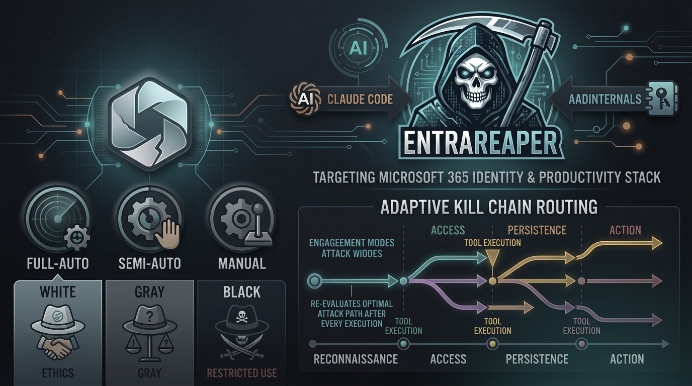

# EntraReaper



**Autonomous Red Team Platform for Microsoft Entra ID**

Part of **[M365 Red Agents](../README.md)**.

65 tools | 87 scenarios | 13 kill chains | 15 engagement folders | 238 AADInternals cmdlets

```
EntraReaper v2.1 | Python 3.11+ | PowerShell 7 | macOS/Linux | License: MIT
```

---

## What is EntraReaper?

EntraReaper is an MCP server that transforms Claude Code into an autonomous red team operator for Microsoft Entra ID. It wraps 238 AADInternals PowerShell cmdlets into 65 purpose-built MCP tools, organized by MITRE ATT&CK phase, with built-in OPSEC governance that prevents runaway operations.

The platform implements a 4-layer architecture: governance (noise budget, evasion engine, engagement tracking), execution (50 attack tools across 12 MITRE phases), intelligence (Conditional Access analysis, privilege escalation path finding, attack graph construction), and reporting (auto-generated reports, MITRE ATT&CK Navigator layers, evidence packages, cleanup checklists). Every tool execution is budget-checked, jitter-delayed, user-agent rotated, and auto-saved to one of 15 engagement folders.

EntraReaper targets the full Microsoft identity and productivity stack: Entra ID (Azure AD), Microsoft 365 (Exchange Online, Teams, SharePoint, OneDrive), and Azure subscriptions. It supports three engagement modes (full-auto, semi-auto, manual), three hat colors (WHITE/GRAY/BLACK), and adaptive kill chain routing that re-evaluates the optimal attack path after every tool execution. It is not designed for Google Workspace or non-Microsoft platforms.

---

## Key Features

| Feature | Details |
|---------|---------|
| **65 MCP Tools** | Recon, credential access, persistence, privesc, lateral movement, collection, impact, evasion, analysis, reporting |
| **87 Attack Scenarios** | Step-by-step playbooks across 17 categories with MITRE mappings and OPSEC ratings |
| **13 Kill Chains (A-M)** | End-to-end attack paths from external recon to full tenant compromise |
| **OPSEC Governance** | Noise budget system (default 100 pts) prevents runaway operations; LOUD tools require human approval |
| **Evasion Engine** | User-agent rotation (8 contexts), timing jitter (4 profiles), FOCI token cascade (37 app pivot) |
| **Adaptive Kill Chain Routing** | Re-evaluates optimal attack path after every tool execution based on tenant configuration |
| **Hat Modes** | WHITE (authorized pentest), GRAY (red team/bounty), BLACK (adversary simulation) |
| **Threat Actor Simulation** | Simulate TTPs from Storm-2372, Nobelium, Midnight Blizzard, and other tracked actors |
| **Post-Exploitation Intelligence** | CA policy gap analysis, privilege escalation path finder, access graph with BFS attack path ranking |
| **15 Engagement Folders** | Auto-save fingerprints, credentials, tokens, loot, noise logs, persistence inventory, playbook journal |
| **Auto-Reporting** | 12-section engagement report, MITRE ATT&CK Navigator JSON, SHA256 evidence manifest, cleanup checklist |
| **3-Layer Injection Prevention** | `create_subprocess_exec` (no shell) + regex cmdlet validation + string sanitization |
| **macOS Native** | PowerShell 7 bridge with C# polyfills for Windows-only assemblies |
| **Easy Extensibility** | Add new tools by decorating a Python function with `@mcp.tool()` |

---

## Quick Start

### Prerequisites

**Minimum requirements:** Python **3.11+**, PowerShell **7+** (`pwsh`), **macOS or Linux**, and the **AADInternals** module. **uv** is the supported way to sync Python dependencies (see Install).

```bash
# PowerShell 7
brew install powershell

# AADInternals module
pwsh -c 'Install-Module AADInternals -Scope CurrentUser -Force'

# uv (Python package manager)
curl -LsSf https://astral.sh/uv/install.sh | sh
```

### Install

```bash
git clone https://github.com/user/EntraReaper.git
cd EntraReaper
uv sync
```

### Run standalone

```bash
uv run python server.py
```

### Add to Claude Code

```bash
claude mcp add entrareaper -- uv run --directory /path/to/EntraReaper python server.py
```

### Verify environment

```bash
# PowerShell setup check
pwsh scripts/setup.ps1

# Or use the automated installer
bash install.sh
```

---

## Usage Examples

### 1. Silent tenant reconnaissance

```
Use EntraReaper to fingerprint contoso.com -- get tenant ID, federation type,
all domains, DNS records, and OpenID configuration. Stay completely silent.
```

Tools used: `recon_tenant`, `recon_domains`, `recon_dns`, `recon_openid`
OPSEC cost: 0 points (all silent)

### 2. User enumeration

```
Enumerate C-suite users at contoso.com: CEO, CFO, CTO, CISO, CIO, COO.
Use the normal method to avoid lockouts.
```

Tools used: `recon_users`
OPSEC cost: 1 point (low)

### 3. Device code phishing with FOCI pivot

```
Run a device code phishing flow targeting admin@contoso.com using the
Microsoft Office client ID. If successful, pivot the token to Exchange,
Teams, and Azure using FOCI family refresh.
```

Tools used: `cred_device_code`, `cred_token_decode`, `evasion_foci_list`, `evasion_audience_switch`
OPSEC cost: 3 points (low)

### 4. Full attack cycle

```
Run Kill Chain A against contoso.com in semi-auto mode with a noise budget
of 50. Start from external recon and work toward Global Admin. Generate a
full report at the end.
```

Tools used: Adaptive -- the agent selects tools based on tenant configuration.
OPSEC cost: Varies (budget-controlled)

---

## Architecture

```
Claude Code (Operator)
    |
    | stdio (MCP protocol)
    |
MCP Server (server.py -- 65 tools)
    |
    +-- LAYER 1: GOVERNANCE
    |   +-- opsec_governor.py    Noise budget (check/spend/report/set)
    |   +-- evasion.py           UA rotation, jitter, FOCI cascade, audience switch
    |   +-- engagement_store.py  Auto-save to 15 folders, playbook journal
    |
    +-- LAYER 2: EXECUTION (50 attack tools across 12 MITRE phases)
    |   +-- Recon (9)            tenant, users, domains, openid, dns, insider, guest, ca_policies, sync_config
    |   +-- Credential (13)      token, device_code, decode, prt, cookie, nthash, mfa_read, token_universal,
    |   |                        token_refresh, otp_generate, otp_new_secret, imds_token
    |   +-- Access (3)           phishing, phishing_teams, guest_invite
    |   +-- Persistence (5)      federation, saml_forge, device, pta_agent, mfa_app
    |   +-- Privesc (3)          azure_admin, password_reset, role_assign
    |   +-- Evasion (2)          audit_logs, policy_weaken
    |   +-- Movement (3)         vm_exec, messaging, partner_pivot
    |   +-- Collection (4)       onedrive, sharepoint, teams, email
    |   +-- Impact (2)           user_ops, config
    |   +-- Azure+Kerberos (2)   enum, kerberos
    |   +-- Session (2)          status, clear_tokens
    |   +-- Raw (1)              invoke (238 cmdlets)
    |
    +-- LAYER 3: INTELLIGENCE
    |   +-- analyzer.py          CA gap analysis, privesc path finder, access graph, attack path ranking
    |
    +-- LAYER 4: REPORTING
    |   +-- reporter.py          Auto-report, MITRE layer, evidence package, cleanup checklist, narrative
    |
    +-- BRIDGE
        +-- bridge.py            asyncio.create_subprocess_exec (NO SHELL)
        +-- compat.ps1           macOS polyfills (System.Web, JavaScriptSerializer)
        |
        v
    pwsh 7 + AADInternals (238 cmdlets)
        |
        v
    Microsoft Entra ID / Azure AD APIs
```

---

## Tool Categories (65 total)

| Category | Count | Tools |
|----------|-------|-------|
| **Recon (unauthenticated)** | 5 | `recon_tenant`, `recon_users`, `recon_domains`, `recon_openid`, `recon_dns` |
| **Recon (authenticated)** | 4 | `recon_insider`, `recon_guest`, `recon_ca_policies`, `recon_sync_config` |
| **Credential Access** | 13 | `cred_token`, `cred_device_code`, `cred_token_decode`, `cred_prt_extract`, `cred_cookie`, `cred_nthash`, `cred_mfa_read`, `cred_token_universal`, `cred_token_refresh`, `cred_otp_generate`, `cred_otp_new_secret`, `cred_imds_token` |
| **Initial Access** | 3 | `access_phishing`, `access_phishing_teams`, `access_guest_invite` |
| **Persistence** | 5 | `persist_federation`, `persist_saml_forge`, `persist_device`, `persist_pta_agent`, `persist_mfa_app` |
| **Privilege Escalation** | 3 | `privesc_azure_admin`, `privesc_password_reset`, `privesc_role_assign` |
| **Defense Evasion** | 2 | `evade_audit_logs`, `evade_policy_weaken` |
| **Lateral Movement** | 3 | `move_vm_exec`, `move_messaging`, `move_partner_pivot` |
| **Collection** | 4 | `collect_onedrive`, `collect_sharepoint`, `collect_teams`, `collect_email` |
| **Impact** | 2 | `impact_user_ops`, `impact_config` |
| **Azure + Kerberos** | 2 | `azure_enum`, `azure_kerberos` |
| **Session** | 3 | `session_status`, `clear_tokens`, `raw_invoke` |
| **OPSEC Governance** | 4 | `opsec_check`, `opsec_budget_check`, `opsec_budget_set`, `opsec_budget_report` |
| **Evasion Engine** | 4 | `evasion_set_ua`, `evasion_jitter`, `evasion_foci_list`, `evasion_audience_switch` |
| **Intelligence** | 3 | `analyze_ca`, `analyze_privesc`, `analyze_attack_graph` |
| **Reporting** | 5 | `report_generate`, `report_mitre_layer`, `report_evidence_package`, `report_cleanup`, `report_narrative` |
| **Engagement** | 1 | `engagement_status` |

---

## Kill Chains (A-M)

| Chain | Name | Path | Description |
|-------|------|------|-------------|
| **A** | External to Global Admin | S01 > S03 > S17 > S20 > S09 > S10 > S15 > S34 | Recon, user enum, device code phish, insider recon, CA audit, MFA audit, Azure escalation |
| **B** | Golden SAML Persistence | S01 > S17 > S09 > S27 > S28 > S49 > S38 | Recon, phish, map tenant, install backdoor, forge tokens, exfil mail, disable logs |
| **C** | BEC Financial Fraud | S03 > S17 > S19 > S49 > S44 > S46 | User enum, phish, FOCI pivot, read mail, send BEC, exfil OneDrive |
| **D** | MSP Supply Chain | S07 > S03 > S17 > S45 > S09 > S50 | Supply chain recon, user enum, phish MSP, pivot to customers, full takeover |
| **E** | Hybrid Infrastructure Takeover | S01 > S17 > S11 > S31 > S24 > S34 > S42 | Recon, phish, map hybrid, rogue PTA, auth as anyone, Azure escalate, VM RCE |
| **F** | Silent Data Exfiltration | S03 > S18 > S19 > S48 > S46 > S47 > S49 | User enum, Teams phish, FOCI pivot, harvest Teams/OneDrive/SharePoint/email |
| **G** | Device Trust Abuse | S01 > S17 > S10 > S29 > S22 > S19 | Recon, phish, CA audit, rogue device, PRT extract, FOCI access everything |
| **H** | MFA Bypass Persistence | S03 > S17 > S15 > S32 > S24 | User enum, phish, MFA audit, rogue auth app, login anytime with TOTP |
| **I** | Silent Persistence | S65 > S17 > S55 > S32 > S63 | Set UA, phish, WHfB key inject, rogue MFA app, EAS device inject (no federation changes) |
| **J** | Insider Threat Data Miner | S65 > S19 > S59 > S47 > S64 > S38 | Set UA, FOCI pivot, SPO inject, SharePoint exfil, compliance search, disable logs |
| **K** | Hybrid Infrastructure Destruction | S52 > S35 > S31 > S57 > S54 > S60 | Extract sync creds, reset all passwords, rogue PTA, downgrade auth, inject health events, redirect logs |
| **L** | FOCI Token Cascade | S66 > S71 > S19 > S46 > S47 > S49 | FOCI enumeration, token refresh chain, cross-resource pivot, exfil OneDrive/SharePoint/mail |
| **M** | Zero-to-Admin Speed Run | S01 > S03 > S17 > S09 > S67 > S69 > S34 > S86 | Tenant fingerprint, user enum, phish, insider dump, CA bypass scan, SP permission audit, Azure takeover |

---

## Scenarios (87 total)

| Category | Scenarios | Count |
|----------|-----------|-------|
| Recon (Unauthenticated) | S01-S08 | 8 |
| Recon (Authenticated) | S09-S16 | 8 |
| Credential Access | S17-S24, S51-S52, S58, S61-S62 | 13 |
| Initial Access | S25-S26 | 2 |
| Persistence | S27-S33, S55, S63 | 9 |
| Privilege Escalation | S34-S37, S59 | 5 |
| Defense Evasion | S38-S41, S54, S57, S60, S65 | 8 |
| Lateral Movement | S42-S45, S53, S56 | 6 |
| Collection/Exfiltration | S46-S49, S64 | 5 |
| Impact | S50 | 1 |
| Advanced Reconnaissance | S66-S69 | 4 |
| Advanced Credential Attacks | S70-S73 | 4 |
| Advanced Phishing | S74-S76 | 3 |
| Advanced Persistence | S77-S79 | 3 |
| Advanced Lateral Movement | S80-S82 | 3 |
| Advanced Collection | S83-S85 | 3 |
| Full Kill Chains | S86-S87 | 2 |
| **Total** | | **87** |

Hat distribution: WHITE 16 (18%) | GRAY 40 (46%) | BLACK 31 (36%)

Full scenario details: [`scenarios/scenarios_87.md`](scenarios/scenarios_87.md)

---

## Engagement Folders (15)

| Folder | Category | Contents |
|--------|----------|----------|
| `fingerprints/` | Intelligence | Tenant identity, per-target, markdown key-value, static |
| `behavior/` | Intelligence | Attack surface, evolving, grows per recon cycle |
| `results/` | Intelligence | Recon snapshots, per-tool, immutable |
| `iocs/` | Intelligence | Indicators of compromise, JSON + markdown, for blue team handoff |
| `tokens/` | Credentials | JWT, refresh, PRT, SAML tokens, per-engagement, per-alias |
| `creds/` | Credentials | NT hashes, MFA secrets, cookies, per-type JSON |
| `certs/` | Credentials | Signing certificates, device certificates, per-type subdirs |
| `loot/` | Collection | Downloaded files, per-target, per-service |
| `playbooks/` | Operations | Execution journal, auto-appended on every tool call |
| `noise/` | Operations | Footprint tracking, predicted vs actual, budget state |
| `persistence/` | Operations | Live backdoors inventory, MUST be cleaned up at engagement end |
| `signals/` | Defense | Detection opportunities, auto-generated from OPSEC profiles |
| `reports/` | Reporting | Final deliverables: report, MITRE layer, evidence, cleanup |
| `scenarios/` | Reference | 87 scenarios + 13 kill chains (read-only) |
| `docs/` | Reference | Architecture, cmdlet reference, cmdlet documentation |

---

## OPSEC Budget System

Every tool has an OPSEC cost. The budget (default: 100 points) prevents runaway operations.

| OPSEC Level | Cost | Examples |
|-------------|------|----------|
| Silent | 0 | `recon_tenant`, `recon_domains`, `recon_openid` |
| Low | 1 | `recon_users`, `cred_device_code` |
| Medium | 5 | `recon_insider`, `collect_*` |
| HIGH | 20 | `cred_nthash`, `privesc_*` |
| LOUD | 50 | `persist_federation`, `evade_audit_logs` |

Budget 100 allows: unlimited silent + 100 low + 20 medium + 5 high + 2 loud.
Proven: Kill Chain A completed with 3 points spent (97% remaining).

---

## Module Inventory

| Module | Lines | Purpose |
|--------|-------|---------|
| `server.py` | 2,140 | MCP server entry point, 65 tool definitions, auto-save hooks |
| `bridge.py` | 230 | PowerShell subprocess bridge (injection-safe, no shell) |
| `token_store.py` | 186 | Named token cache with persistence and expiry tracking |
| `opsec.py` | 188 | 18 OPSEC profiles (noise level + detection risk per tool) |
| `opsec_governor.py` | 380 | Noise budget system (check, spend, report, set, reset) |
| `evasion.py` | 453 | UA rotation (8 contexts), jitter (4 profiles), FOCI (37 apps) |
| `analyzer.py` | 868 | CA gap analysis, privesc finder, access graph, path ranking |
| `reporter.py` | 965 | 12-section report, MITRE layer, evidence, cleanup, narrative |
| `engagement_store.py` | 597 | Auto-save to 15 folders with playbook journaling |
| `ioc_store.py` | 289 | IOC collection, deduplication, markdown export |
| **Total** | **~6,300** | |

---

## Documentation

| Document | Location | Description |
|----------|----------|-------------|
| Architecture (detailed) | [`docs/architecture_v2.1.md`](docs/architecture_v2.1.md) | System diagrams, data flow, module dependencies |
| Cmdlet Reference | [`docs/cmdlet_reference.md`](docs/cmdlet_reference.md) | 238 cmdlets with parameter signatures |
| Cmdlet Documentation | [`docs/cmdlet_documentation.md`](docs/cmdlet_documentation.md) | 246 cmdlets with descriptions and examples |
| Cmdlet Source Map | [`docs/cmdlet_source_map.md`](docs/cmdlet_source_map.md) | 244 exported + 274 internal cmdlets from GitHub source |
| Scenarios (87) | [`scenarios/scenarios_87.md`](scenarios/scenarios_87.md) | All scenarios with hat color, OPSEC, MITRE, and step-by-step tools |
| Scenarios (core 12) | [`scenarios/scenarios_core.md`](scenarios/scenarios_core.md) | Quick reference for the 12 most common scenarios |
| FOCI App IDs | [`black-white/FOCI-app/EntraID-EA.md`](black-white/FOCI-app/EntraID-EA.md) | 180+ Entra ID app IDs (FOCI, BroCI, known-bad) |

---

## Security Design

**3-layer injection prevention:**

1. `asyncio.create_subprocess_exec` -- no shell interpretation, arguments passed as array
2. Regex cmdlet validation -- only `AADInternals*` pattern allowed
3. String sanitization -- single quotes escaped to double single quotes

**Operational safety:**

- Noise budget prevents uncontrolled operation sprawl
- LOUD tools require human approval regardless of engagement mode
- Persistence inventory tracks all planted backdoors for mandatory cleanup
- Cleanup checklist generator enforces teardown at engagement end
- SHA256 evidence hashing provides chain of custody
- Per-engagement token store prevents cross-engagement contamination
- Timeout protection: 120s standard, 600s for long operations

---

## Legal Disclaimer

EntraReaper is designed for **authorized security testing only**.

Unauthorized access to computer systems is illegal under the Computer Fraud and Abuse Act (CFAA), the UK Computer Misuse Act, and equivalent legislation worldwide. **Always obtain written authorization before testing.** Ensure your scope of engagement explicitly covers Entra ID, Azure AD, and Microsoft 365 testing.

The authors assume no liability for misuse of this tool. By using EntraReaper, you agree that you are solely responsible for your actions and that you have proper authorization for any testing performed.

This tool is provided "as is" without warranty of any kind.

---

## Credits

- **[AADInternals](https://github.com/Gerenios/AADInternals)** by Dr. Nestori Syynimaa ([@DrAzureAD](https://twitter.com/DrAzureAD)) -- the PowerShell module that makes this all possible
- **Secureworks** -- FOCI (Family of Client IDs) research that exposed cross-app token pivot attacks
- **SpecterOps** -- BroCI/NAA research on Native Authentication Application abuse patterns
- **MITRE ATT&CK** -- framework for technique classification and kill chain mapping

---

## License

MIT License. See [LICENSE](LICENSE) for details.
